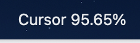
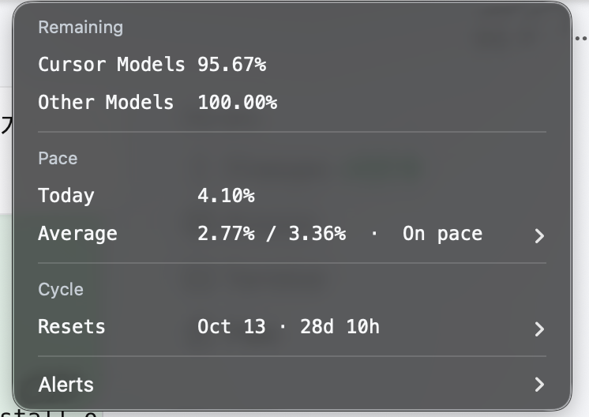

# Cursor Usage for SwiftBar

macOS [SwiftBar](https://swiftbar.app/) plugin that shows remaining Cursor Models usage in the menu bar.





The plugin reads the local Cursor session from `state.vscdb` at runtime, calls unofficial `api2.cursor.sh` endpoints, and never stores, logs, or prints the access token. Conversation content is not read.

This API is unofficial and can change. The plugin shows an error instead of a stale value when the session or payload is unusable.

## Layout

```text
cursor-usage.1m.py   # SwiftBar plugin (copy this file)
tests/               # unit tests, no live Cursor session required
assets/title.png     # menu-bar title
assets/menu.png      # dropdown
AGENTS.md
```

## Install

1. Install SwiftBar.
2. Copy `cursor-usage.1m.py` into the SwiftBar plugin folder.
3. `chmod +x cursor-usage.1m.py` if needed.
4. Refresh the plugin. Title shape: `Cursor 97.82%`.

Requires a signed-in Cursor app on the same Mac. Python 3.9+ (macOS `/usr/bin/python3` is enough). Network access is used only to `api2.cursor.sh`.

## Tests

```sh
python3 tests/test_cursor_usage.py
```

## Menu

- Title: remaining Cursor Models (`100 - autoPercentUsed`), two decimals.
- Remaining / Other Models. Remaining or Cursor Models opens `https://cursor.com/dashboard/spending`.
- Pace: today usage, average vs target (`On pace` / `Over pace`). Hourly is under Average.
- Cycle: reset date + time left. Plan is under Resets.
- Alerts: billing reset and remaining thresholds 50 / 25 / 10.
- Refresh is shown only when fetch fails.

Do not commit Cursor tokens, `state.vscdb`, or SwiftBar plugin-data JSON.
